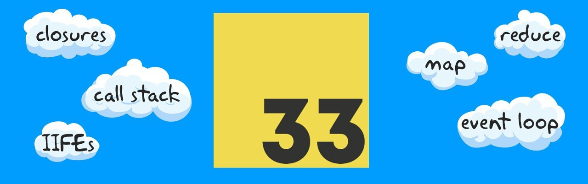
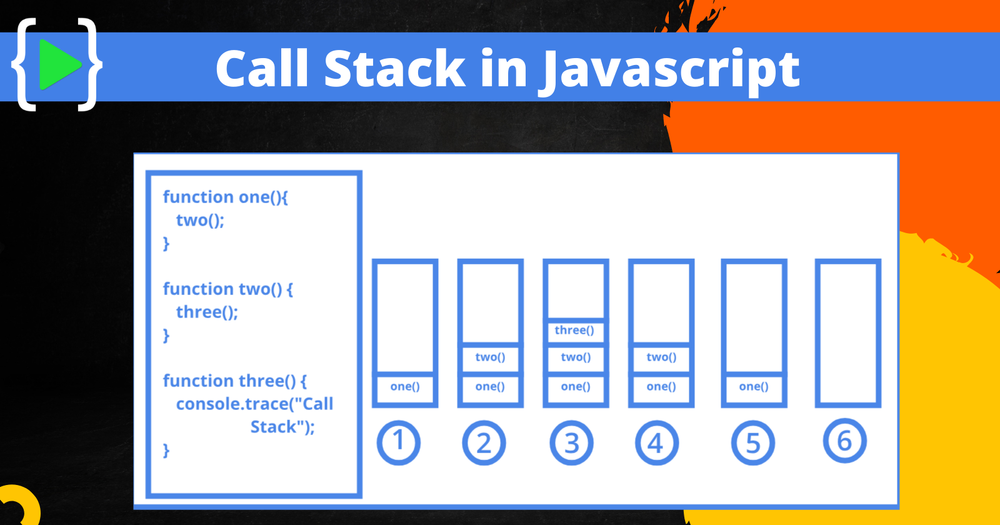
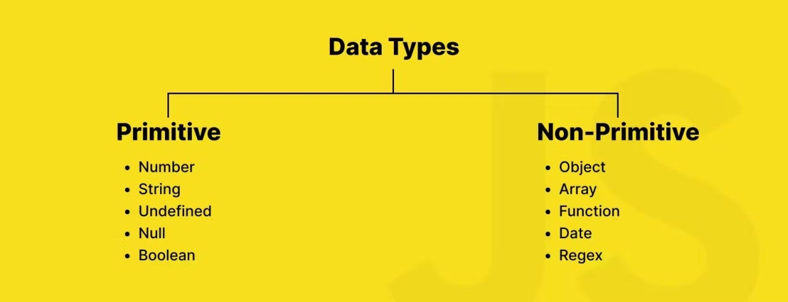
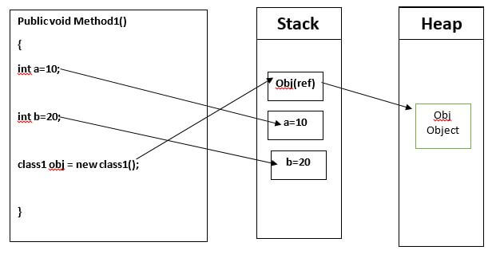
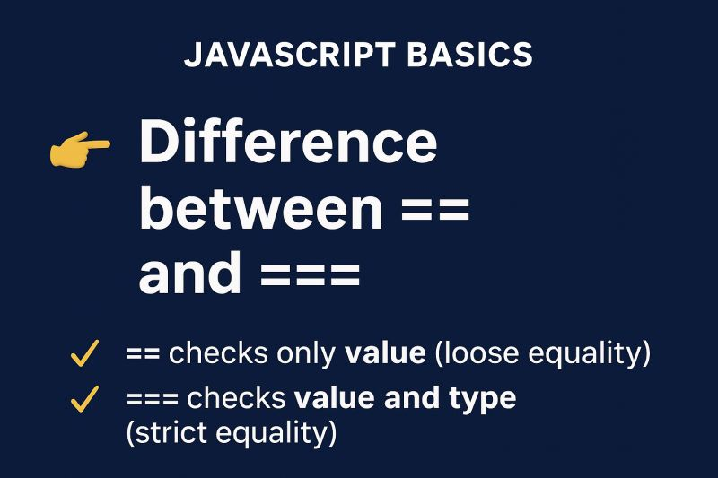
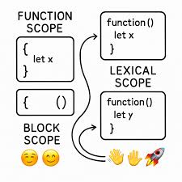
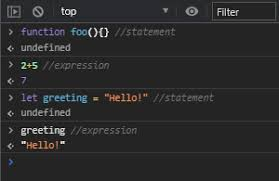

  

## Introduction 
  In this repository, I share many important and well-known JavaScript concepts that are essential and helpful in our careers as developers. This repo also helps my colleagues discover and immerse themselves in this language
## Table of Contents

1. [**Call Stack**](#1-call-stack)
2. [**Primitive Types**](#2-primitive-types)
3. [**Value Types and Reference Types**](#3-value-types-and-reference-types)
4. [**Implicit, Explicit, Nominal, Structuring and Duck Typing**](#4-implicit-explicit-nominal-structuring-and-duck-typing)
5. [**== vs === vs typeof**](#5--vs--vs-typeof)
6. [**Function Scope, Block Scope and Lexical Scope**](#6-function-scope-block-scope-and-lexical-scope)
7. [**Expression vs Statement**](#7-expression-vs-statement)
8. [**IIFE, Modules and Namespaces**](#8-iife-modules-and-namespaces)
9. [**Message Queue and Event Loop**](#9-message-queue-and-event-loop)
10. [**setTimeout, setInterval and requestAnimationFrame**](#10-settimeout-setinterval-and-requestanimationframe)
11. [**JavaScript Engines**](#11-javascript-engines)
12. [**Bitwise Operators, Type Arrays and Array Buffers**](#12-bitwise-operators-type-arrays-and-array-buffers)
13. [**DOM and Layout Trees**](#13-dom-and-layout-trees)
14. [**Factories and Classes**](#14-factories-and-classes)
15. [**this, call, apply and bind**](#15-this-call-apply-and-bind)
16. [**new, Constructor, instanceof and Instances**](#16-new-constructor-instanceof-and-instances)
17. [**Prototype Inheritance and Prototype Chain**](#17-prototype-inheritance-and-prototype-chain)
18. [**Object.create and Object.assign**](#18-objectcreate-and-objectassign)
19. [**map, reduce, filter**](#19-map-reduce-filter)
20. [**Pure Functions, Side Effects, State Mutation and Event Propagation**](#20-pure-functions-side-effects-state-mutation-and-event-propagation)
21. [**Closures**](#21-closures)
22. [**High Order Functions**](#22-high-order-functions)
23. [**Recursion**](#23-recursion)
24. [**Collections and Generators**](#24-collections-and-generators)
25. [**Promises**](#25-promises)
26. [**async/await**](#26-asyncawait)
27. [**Data Structures**](#27-data-structures)
28. [**Expensive Operation and Big O Notation**](#28-expensive-operation-and-big-o-notation)
29. [**Algorithms**](#29-algorithms)
30. [**Inheritance, Polymorphism and Code Reuse**](#30-inheritance-polymorphism-and-code-reuse)
31. [**Design Patterns**](#31-design-patterns)
32. [**Partial Applications, Currying, Compose and Pipe**](#32-partial-applications-currying-compose-and-pipe)
33. [**Clean Code**](#33-clean-code)

## 1. Call Stack

The call stack is a mechanism that the JavaScript interpreter uses to keep track of function execution within a program. In JavaScript, functions are executed in the order they are called. The call stack follows the Last In, First Out (LIFO) principle, meaning that the last function pushed onto the stack is the first one to be executed.

According to the ECMAScript specification, the call stack is defined as part of the execution context. Whenever a function is called, a new execution context is created and placed at the top of the stack. Once the function completes, its execution context is removed from the stack, and control returns to the previous context. This helps manage synchronous code execution, as each function call must complete before the next one can begin.

### Reference

-  [Call Stack — MDN](https://developer.mozilla.org/en-US/docs/Glossary/Call_stack)

###  Articles

-  [Understanding Javascript Call Stack, Event Loops — Gaurav Pandvia](https://medium.com/@gaurav.pandvia/understanding-javascript-function-executions-tasks-event-loop-call-stack-more-part-1-5683dea1f5ec)
-  [Understanding the JavaScript Call Stack — Charles Freeborn](https://medium.freecodecamp.org/understanding-the-javascript-call-stack-861e41ae61d4)
-  [Javascript: What Is The Execution Context? What Is The Call Stack? — Valentino Gagliardi](https://medium.com/@valentinog/javascript-what-is-the-execution-context-what-is-the-call-stack-bd23c78f10d1)
-  [What is the JS Event Loop and Call Stack? — Jess Telford](https://gist.github.com/jesstelford/9a35d20a2aa044df8bf241e00d7bc2d0)
-  [Understanding Execution Context and Execution Stack in Javascript — Sukhjinder Arora](https://blog.bitsrc.io/understanding-execution-context-and-execution-stack-in-javascript-1c9ea8642dd0)
-  [How JavaScript Works Under The Hood: An Overview of JavaScript Engine, Heap and, Call Stack — Bipin Rajbhar](https://dev.to/bipinrajbhar/how-javascript-works-under-the-hood-an-overview-of-javascript-engine-heap-and-call-stack-1j5o)
-  [The JS Call stack Explained in 9 minutes](https://www.youtube.com/watch?v=W8AeMrVtFLY) - Colt Steel (YouTube)

###   Videos

-  [Javascript: the Call Stack explained — Coding Blocks India](https://www.youtube.com/watch?v=w6QGEiQceOM)
-  [The JS Call Stack Explained In 9 Minutes — Colt Steele](https://www.youtube.com/watch?v=W8AeMrVtFLY)
-  [What is the Call Stack? — Eric Traub](https://www.youtube.com/watch?v=w7QWQlkLY_s)
-  [The Call Stack — Kevin Drumm](https://www.youtube.com/watch?v=Q2sFmqvpBe0)
-  [Understanding JavaScript Execution — Codesmith](https://www.youtube.com/watch?v=Z6a1cLyq7Ac&list=PLWrQZnG8l0E4kd1T_nyuVoxQUaYEWFgcD)
-  [What the heck is the event loop anyway? — Philip Roberts](https://www.youtube.com/watch?v=8aGhZQkoFbQ)
-  [How JavaScript Code is executed? ❤️& Call Stack — Akshay Saini](https://www.youtube.com/watch?v=iLWTnMzWtj4&list=PLlasXeu85E9cQ32gLCvAvr9vNaUccPVNP)
-  [Call Stacks - CS50](https://www.youtube.com/watch?v=aCPkszeKRa4)
-  [Learn the JavaScript Call Stack - codecupdev](https://www.youtube.com/watch?v=HXqXPGS96rw)
-  [JavaScript Functions and the Call Stack | How does the Call stack work - Chidre'sTechTutorials](https://www.youtube.com/watch?v=P6H-T4cUDR4)

    
**[⬆ See the index.js](index.js)**

---

## 2. Primitive Types

According to the ECMAScript specification, JavaScript has six primitive data types: string, number, bigint, boolean, undefined, and symbol. These types are immutable, meaning their values cannot be altered. There is also a special primitive type called null, which represents the intentional absence of any object value.

Primitive values are directly assigned to a variable, and when you manipulate a primitive type, you're working directly on the value. Unlike objects, primitives do not have properties or methods, but JavaScript automatically wraps primitive values with object counterparts when necessary (e.g., when calling methods on strings).

### Reference

-  [JavaScript data types and data structures — MDN](https://developer.mozilla.org/en-US/docs/Web/JavaScript/Data_structures#Primitive_values)

###  Articles

-  [Primitive and Non-primitive data-types in JavaScript - GeeksforGeeks](https://www.geeksforgeeks.org/primitive-and-non-primitive-data-types-in-javascript)
-  [How numbers are encoded in JavaScript — Dr. Axel Rauschmayer](http://2ality.com/2012/04/number-encoding.html)
-  [What Every JavaScript Developer Should Know About Floating Point Numbers — Chewxy](https://blog.chewxy.com/2014/02/24/what-every-javascript-developer-should-know-about-floating-point-numbers/)
-  [The Secret Life of JavaScript Primitives — Angus Croll](https://javascriptweblog.wordpress.com/2010/09/27/the-secret-life-of-javascript-primitives/)
-  [Primitive Types — Flow](https://flow.org/en/docs/types/primitives/)
-  [(Not) Everything in JavaScript is an Object — Daniel Li](https://dev.to/d4nyll/not-everything-in-javascript-is-an-object)
-  [JavaScript data types and data structures — MDN](https://developer.mozilla.org/en-US/docs/Web/JavaScript/Data_structures#Primitive_values)
-  [Diving Deeper in JavaScripts Objects — Arfat Salman](https://blog.bitsrc.io/diving-deeper-in-javascripts-objects-318b1e13dc12)
-  [The differences between Object.freeze() vs Const in JavaScript — Bolaji Ayodeji](https://medium.com/@bolajiayodeji/the-differences-between-object-freeze-vs-const-in-javascript-4eacea534d7c)
-  [Object to primitive conversion — JavaScript.Info](https://javascript.info/object-toprimitive)
- [Methods of primitives - Javascript.info](https://javascript.info/primitives-methods)

###   Videos

- [JavaScript Reference vs Primitive Types — Academind](https://www.youtube.com/watch?v=9ooYYRLdg_g)
- [JavaScript Primitive Types — Simon Sez IT](https://www.youtube.com/watch?v=HsbWQsSCE5Y)
- [Value Types and Reference Types in JavaScript — Programming with Mosh](https://www.youtube.com/watch?v=e-_mDyqm2oU)
- [JavaScript Primitive Data Types — Avelx](https://www.youtube.com/watch?v=qw3j0A3DIzQ)
- [Everything you never wanted to know about JavaScript numbers — Bartek Szopka](https://www.youtube.com/watch?v=MqHDDtVYJRI)
- [What are variables in Javascript? — JS For Everyone](https://www.youtube.com/watch?v=B4Bbmei_thw)
- [TIPOS DE DATOS PRIMITIVOS en JAVASCRIPT - La Cocina del Código](https://www.youtube.com/watch?v=cC65D2q5f8I)
- [Data Type in JavaScript - ScholarHat](https://www.youtube.com/watch?v=aFDvBjVjCh8)
    
**[⬆ See the index.js](index.js)**
---

---

## 3. Value Types and Reference Types

According to the ECMAScript specification, value types are stored directly in the location that the variable accesses. These include types like number, string, boolean, undefined, bigint, symbol, and null. When you assign a value type to a variable, the value itself is stored.

Reference types, on the other hand, are objects stored in the heap. Variables assigned to reference types actually store references (pointers) to the objects, not the objects themselves. When you assign a reference type to another variable, both variables reference the same object in memory.

###  Articles

-  [Explaining Value vs. Reference in Javascript — Arnav Aggarwal](https://codeburst.io/explaining-value-vs-reference-in-javascript-647a975e12a0)
-  [Primitive Types & Reference Types in JavaScript — Bran van der Meer](https://gist.github.com/branneman/7fb06d8a74d7e6d4cbcf75c50fec599c)
-  [Value Types, Reference Types and Scope in JavaScript — Ben Aston](https://medium.com/@benastontweet/lesson-1b-javascript-fundamentals-380f601ba851)
-  [Back to roots: JavaScript Value vs Reference — Miro Koczka](https://medium.com/dailyjs/back-to-roots-javascript-value-vs-reference-8fb69d587a18)
-  [Grasp "By Value" and "By Reference" in JavaScript — Léna Faure](https://hackernoon.com/grasp-by-value-and-by-reference-in-javascript-7ed75efa1293)
-  [JavaScript Reference and Copy Variables — Vítor Capretz](https://hackernoon.com/javascript-reference-and-copy-variables-b0103074fdf0)
-  [JavaScript Primitive vs Reference Values](http://www.javascripttutorial.net/javascript-primitive-vs-reference-values/)
-  [JavaScript by Reference vs. by Value — nrabinowitz](https://stackoverflow.com/questions/6605640/javascript-by-reference-vs-by-value)
-  [JavaScript Interview Prep: Primitive vs. Reference Types — Mike Cronin](https://dev.to/mostlyfocusedmike/javascript-interview-prep-primitive-vs-reference-types-3o4f)
-  [JavaScript map vs. forEach: When to Use Each One - Sajal Soni](https://code.tutsplus.com/tutorials/javascript-map-vs-foreach-when-to-use-each-one--cms-38365)

###   Videos

- [Javascript Pass by Value vs Pass by Reference — techsith](https://www.youtube.com/watch?v=E-dAnFdq8k8)
- [JavaScript Value vs Reference Types — Programming with Mosh](https://www.youtube.com/watch?v=fD0t_DKREbE)
- [VALORES vs REFERENCIAS en JAVASCRIPT - La Cocina del Código](https://www.youtube.com/watch?v=AvkyOrWkuQc)
- [JavaScript - Reference vs Primitive Values/ Types - Academind](https://www.youtube.com/watch?v=9ooYYRLdg_g)
- [Value Types and Reference Types in JavaScript - Programming with Mosh](https://www.youtube.com/watch?v=e-_mDyqm2oU)

    
    

**[⬆ See the index.js](index.js)**

---

## 4. Implicit, Explicit, Nominal, Structuring and Duck Typing

The ECMAScript specification defines JavaScript as a dynamically typed language, meaning that types are associated with values rather than variables, and type checking occurs at runtime. There are various ways JavaScript manages types:

<strong>Implicit Typing (or Type Coercion):</strong> This occurs when JavaScript automatically converts one data type to another when required. For instance, JavaScript might convert a string to a number during an arithmetic operation. While this can simplify some code, it can also lead to unexpected results if not handled carefully.

<strong>Explicit Typing:</strong> Unlike implicit typing, explicit typing involves manually converting a value from one type to another using functions like Number(), String(), or Boolean().

<strong>Nominal Typing:</strong> JavaScript doesn't natively support nominal typing, where types are explicitly declared and checked. However, TypeScript, a superset of JavaScript, brings this feature to help catch type errors during development.

<strong>Structural Typing:</strong> In this type system, types are based on the structure or properties of the data. JavaScript is a structurally typed language where objects are compatible if they share the same structure (i.e., the same set of properties and methods).

<strong>Duck Typing:</strong> This is a concept where an object's suitability is determined by the presence of certain properties and methods, rather than by the actual type of the object. JavaScript relies heavily on duck typing, where behavior is inferred from an object's properties rather than its declared type.

###  Articles

-  [What you need to know about Javascript's Implicit Coercion — Promise Tochi](https://dev.to/promhize/what-you-need-to-know-about-javascripts-implicit-coercion-e23)
-  [JavaScript Type Coercion Explained — Alexey Samoshkin](https://medium.freecodecamp.org/js-type-coercion-explained-27ba3d9a2839)
-  [Javascript Coercion Explained — Ben Garrison](https://hackernoon.com/javascript-coercion-explained-545c895213d3)
-  [What exactly is Type Coercion in Javascript? - Stack Overflow](https://stackoverflow.com/questions/19915688/what-exactly-is-type-coercion-in-javascript)

###   Videos

- [== ? === ??? ...#@^% - Shirmung Bielefeld](https://www.youtube.com/watch?v=qGyqzN0bjhc&t)
- [Coercion in Javascript - Hitesh Choudhary](https://www.youtube.com/watch?v=b04Q_vyqEG8)
- [JavaScript Questions: What is Coercion? - Steven Hancock](https://www.youtube.com/watch?v=z4-8wMSPJyI)
- [Typing: Static vs Dynamic, Weak vs. Strong - Codexpanse](https://www.youtube.com/watch?v=C5fr0LZLMAs)
- [EL SISTEMA de TIPOS DE JAVASCRIPT - La Cocina del Código](https://www.youtube.com/watch?v=0ei4nb49GKo)
- [Duck Typing in Javascript - Techmaker Studio](https://www.youtube.com/watch?v=oEpgyoMEkrM)
- [Duck Typing in Javascript - Programming with Kartik](https://youtu.be/e4X1KAuk6Bs?si=krZKbsM2i3tmIl2G)

### Books

- [You Don't Know JS, 1st Edition: Types & Grammar — Kyle Simpson](https://github.com/getify/You-Dont-Know-JS/tree/1st-ed)

    

**[⬆ See the index.js](index.js)**

---

## 5. == vs === vs typeof
 According to the ECMAScript specification, JavaScript includes both strict (===) and loose (==) equality operators, which behave differently when comparing values. Here's a breakdown:

== (Loose Equality): This operator performs type coercion before comparing two values. If the values are of different types, JavaScript will attempt to convert one or both values to a common type before comparison, which can lead to unexpected results.

=== (Strict Equality): This operator compares both the value and the type without any type coercion. If the two values are not of the same type, the comparison will return false.

typeof Operator: The typeof operator is used to check the data type of a variable. While it's generally reliable, there are certain quirks, like how typeof null returns "object" instead of "null", due to a long-standing behavior in JavaScript's implementation.

###  Articles

-  [JavaScript Double Equals vs. Triple Equals — Brandon Morelli](https://codeburst.io/javascript-double-equals-vs-triple-equals-61d4ce5a121a)
-  [Should I use === or == equality comparison operator in JavaScript? — Panu Pitkamaki](https://bytearcher.com/articles/equality-comparison-operator-javascript/)
-  [Why Use the Triple-Equals Operator in JavaScript? — Louis Lazaris](https://www.impressivewebs.com/why-use-triple-equals-javascipt/)
-  [What is the difference between == and === in JavaScript? — Craig Buckler](https://www.oreilly.com/learning/what-is-the-difference-between-and-in-javascript)
-  [Why javascript's typeof always return "object"? — Stack Overflow](https://stackoverflow.com/questions/3787901/why-javascripts-typeof-always-return-object)
-  [Checking Types in Javascript — Toby Ho](http://tobyho.com/2011/01/28/checking-types-in-javascript/)
-  [How to better check data types in JavaScript — Webbjocke](https://webbjocke.com/javascript-check-data-types/)
-  [Checking for the Absence of a Value in JavaScript — Tomer Aberbach](https://tomeraberba.ch/html/post/checking-for-the-absence-of-a-value-in-javascript.html)
-  [Difference Between == and === in Javascript](https://www.scaler.com/topics/javascript/difference-between-double-equals-and-triple-equals-in-javascript/)    
-  [Difference between == and === in JavaScript — GeeksforGeeks](https://www.geeksforgeeks.org/difference-between-double-equal-vs-triple-equal-javascript/)
-  [=== vs == Comparision in JavaScript — FreeCodeCamp](https://www.freecodecamp.org/news/javascript-triple-equals-sign-vs-double-equals-sign-comparison-operators-explained-with-examples/)

###   Videos

- [JavaScript - The typeof operator — Java Brains](https://www.youtube.com/watch?v=ol_su88I3kw)
- [Javascript typeof operator — DevDelight](https://www.youtube.com/watch?v=qPYhTPt_SbQ)
- [JavaScript "==" VS "===" — Web Dev Simplified](https://www.youtube.com/watch?v=C5ZVC4HHgIg)
- [=== vs == in javascript - Hitesh Choudhary](https://www.youtube.com/watch?v=a0S1iG3TgP0)
- [The typeof operator in JS - CodeVault](https://www.youtube.com/watch?v=NSS5WRcv7yM)

    

**[⬆ See the index.js](index.js)**

## 6. Function Scope, Block Scope and Lexical Scope
 The ECMAScript specification outlines three key types of scope:

Function Scope: Variables declared within a function using var are only accessible within that function. This scope isolates variables from being accessed outside of the function where they are declared.

Block Scope: Introduced with ES6, variables declared with let and const are block-scoped. This means they are only accessible within the specific block {} in which they are defined, such as inside loops or conditionals.

Lexical Scope: Refers to how variable access is determined based on the physical location of the variables in the code. Functions are lexically scoped, meaning that they can access variables from their parent scope.

### Books

- [You Don't Know JS Yet, 2nd Edition: Scope & Closures — Kyle Simpson](https://github.com/getify/You-Dont-Know-JS/tree/2nd-ed/scope-closures)

###  Articles

-  [JavaScript Functions — Understanding The Basics — Brandon Morelli](https://codeburst.io/javascript-functions-understanding-the-basics-207dbf42ed99)
-  [Var, Let, and Const – What's the Difference?](https://www.freecodecamp.org/news/var-let-and-const-whats-the-difference/)
-  [Functions in JavaScript - Deepa Pandey](https://www.scaler.com/topics/javascript/javascript-functions/)
-  [Emulating Block Scope in JavaScript — Josh Clanton](http://adripofjavascript.com/blog/drips/emulating-block-scope-in-javascript.html)
-  [The Difference Between Function and Block Scope in JavaScript — Joseph Cardillo](https://medium.com/@josephcardillo/the-difference-between-function-and-block-scope-in-javascript-4296b2322abe)
-  [Understanding Scope and Context in JavaScript — Ryan Morr](http://ryanmorr.com/understanding-scope-and-context-in-javascript/)
-  [JavaScript Scope and Closures — Zell Liew](https://css-tricks.com/javascript-scope-closures/)
-  [Understanding Scope in JavaScript — Wissam Abirached](https://developer.telerik.com/topics/web-development/understanding-scope-in-javascript/)
-  [Understanding Scope in JavaScript ― Hammad Ahmed](https://scotch.io/tutorials/understanding-scope-in-javascript)
-  [When to use a function declaration vs. a function expression ― Amber Wilkie](https://medium.freecodecamp.org/when-to-use-a-function-declarations-vs-a-function-expression-70f15152a0a0)
-  [A JavaScript Fundamentals Cheat Sheet: Scope, Context, and "this" ― Alexandra Fren](https://dev.to/alexandrafren/a-javascript-fundamentals-cheat-sheet-scope-context-and-this-28ai)
-  [Functions / Function scope ― MDN](https://developer.mozilla.org/en-US/docs/Web/JavaScript/Guide/Functions#function_scope)

###   Videos

- [What Makes Javascript Weird ... and Awesome pt. 4 — LearnCode.academy](https://www.youtube.com/watch?v=SBwoFkRjZvE)
- [Variable Scope in JavaScript — Kirupa Chinnathambi](https://www.youtube.com/watch?v=dhp57T3p760)
- [JavaScript Block Scope and Function Scope — mmtuts](https://www.youtube.com/watch?v=aK_nuUAdr8E)
- [What the Heck is Lexical Scope? — NWCalvank](https://www.youtube.com/watch?v=GhNA0r10MmA)
- [Variable Scope — Steve Griffith](https://www.youtube.com/watch?v=FyWdrCZZavQ)
- [Javascript Tutorials for Beginners — Mosh Hemadani](https://www.youtube.com/watch?v=W6NZfCO5SIk)
- [JavaScript Block scope vs Function scope - nivek](https://www.youtube.com/watch?v=IaTztAtoNEY)
- [Lexical scoping in javascript - Hitesh Choudhary](https://www.youtube.com/watch?v=qT5S7GgIioE)
- [Modern Scope Handling in JavaScript (ES6 and Beyond) -Prashant Dewangan ](https://www.youtube.com/watch?v=zMseUdOR7z8)

    

**[⬆ See the index.js](index.js)**

## 7. Expression vs Statement
According to the ECMAScript specification, expressions produce a value, and statements are instructions to perform an action, such as variable assignment or control flow. Function declarations are hoisted and can be called before they are defined in the code, while function expressions are not hoisted and must be defined before being invoked.

###  Articles

-  [All you need to know about Javascript's Expressions, Statements and Expression Statements — Promise Tochi](https://dev.to/promhize/javascript-in-depth-all-you-need-to-know-about-expressions-statements-and-expression-statements-5k2)
-  [Function Expressions vs Function Declarations — Paul Wilkins](https://www.sitepoint.com/function-expressions-vs-declarations/)
-  [JavaScript Function — Declaration vs Expression — Ravi Roshan](https://medium.com/@raviroshan.talk/javascript-function-declaration-vs-expression-f5873b8c7b38)
-  [Function Declarations vs. Function Expressions — Mandeep Singh](https://medium.com/@mandeep1012/function-declarations-vs-function-expressions-b43646042052)
-  [Function Declarations vs. Function Expressions — Anguls Croll](https://javascriptweblog.wordpress.com/2010/07/06/function-declarations-vs-function-expressions/)
- [Expression statement — MDN web docs](https://developer.mozilla.org/en-US/docs/Web/JavaScript/Reference/Statements/Expression_statement)

###   Videos

- [Expressions vs. Statements in JavaScript — Hexlet](https://www.youtube.com/watch?v=WVyCrI1cHi8)
- [JavaScript - Expression vs. Statement — WebTunings](https://www.youtube.com/watch?v=3jDpNGJkupA)
- [Javascript Function Expression Vs Declaration For Beginners — Dev Material](https://www.youtube.com/watch?v=qz7Nq1tV7Io)
- [The difference between an expression and a statement in JavaScript](https://youtu.be/eWTuFoBYiwg)
- [Expression in javascript | Statement in javascript - Sathelli Srikanth](https://www.youtube.com/watch?v=cVDs3TZ-kXs)

    
        
**[⬆ See the index.js](index.js)**

---
---

## 8. IIFE, Modules and Namespaces
With the introduction of ES6 modules, the role of IIFEs in scope isolation has diminished but they still remain relevant.
### Reference

-  [IIFE — MDN](https://developer.mozilla.org/en-US/docs/Glossary/IIFE)
-  [Modularity — MDN](https://developer.mozilla.org/en-US/docs/Glossary/modularity)
-  [Namespace — MDN](https://developer.mozilla.org/en-US/docs/Glossary/Namespace)

###  Articles

-  [Mastering Immediately-Invoked Function Expressions ― Chandra Gundamaraju](https://medium.com/@vvkchandra/essential-javascript-mastering-immediately-invoked-function-expressions-67791338ddc6)
-  [JavaScript Immediately Invoked Function Expression — javascripttutorial.net](https://www.javascripttutorial.net/javascript-immediately-invoked-function-expression-iife/)
-  [A 10 minute primer to JavaScript modules, module formats, module loaders and module bundlers ― Jurgen Van de Moere](https://www.jvandemo.com/a-10-minute-primer-to-javascript-modules-module-formats-module-loaders-and-module-bundlers/)
-  [Modules ― Exploring JS](http://exploringjs.com/es6/ch_modules.html)
-  [Understanding ES6 Modules — Craig Buckler](https://www.sitepoint.com/understanding-es6-modules/)
-  [An overview of ES6 Modules in JavaScript — Brent Graham](https://blog.cloud66.com/an-overview-of-es6-modules-in-javascript/)
-  [ES6 Modules in Depth — Nicolás Bevacqua](https://ponyfoo.com/articles/es6-modules-in-depth)
-  [ES6 modules, Node.js and the Michael Jackson Solution — Alberto Gimeno](https://medium.com/dailyjs/es6-modules-node-js-and-the-michael-jackson-solution-828dc244b8b)
-  [JavaScript Modules: A Beginner's Guide — Preethi Kasireddy](https://medium.freecodecamp.org/javascript-modules-a-beginner-s-guide-783f7d7a5fcc)
-  [Using JavaScript modules on the web — Addy Osmani & Mathias Bynens](https://developers.google.com/web/fundamentals/primers/modules)
-  [IIFE: Immediately Invoked Function Expressions — Parwinder](https://dev.to/bhagatparwinder/iife-immediately-invoked-function-expressions-49c5)
-  [Javascript Module Bundlers — Vanshu Hassija](https://sassy-butter-197.notion.site/Javascript-bundlers-016932b17b0744e983c2cc0db31e6f02)

###   Videos

- [Immediately Invoked Function Expression - Beau teaches JavaScript — freeCodeCamp](https://www.youtube.com/watch?v=3cbiZV4H22c)
- [Understanding JavaScript IIFE — Sheo Narayan](https://www.youtube.com/watch?v=I5EntfMeIIQ)
- [JavaScript Modules: ES6 Import and Export — Kyle Robinson](https://www.youtube.com/watch?v=_3oSWwapPKQ)
- [ES6 - Modules — Ryan Christiani](https://www.youtube.com/watch?v=aQr2bV1BPyE)
- [ES6 Modules in the Real World — Sam Thorogood](https://www.youtube.com/watch?v=fIP4pjAqCtQ)
- [ES6 Modules — TempleCoding](https://www.youtube.com/watch?v=5P04OK6KlXA)
- [JavaScript IIFE (Immediately Invoked Function Expressions) — Steve Griffith](https://www.youtube.com/watch?v=Xd7zgPFwVX8&)

    
    

**[⬆ See the index.js](index.js)**

---
---

## 9. Message Queue and Event Loop
The Event Loop is a critical part of JavaScript's concurrency model, ensuring non-blocking behavior by processing tasks in an asynchronous manner. Understanding how it interacts with the Message Queue and Microtasks is key to mastering JavaScript behavior.
###  Articles

-  [JavaScript Event Loop Explained — Anoop Raveendran](https://medium.com/front-end-hacking/javascript-event-loop-explained-4cd26af121d4)
-  [Understanding JS: The Event Loop — Alexander Kondov](https://hackernoon.com/understanding-js-the-event-loop-959beae3ac40)
-  [The JavaScript Event Loop — Flavio Copes](https://flaviocopes.com/javascript-event-loop/)
-  [Tasks, microtasks, queues and schedules — Jake Archibald](https://jakearchibald.com/2015/tasks-microtasks-queues-and-schedules/)
-  [Visualising the JavaScript Event Loop with a Pizza Restaurant analogy — Priyansh Jain](https://dev.to/presto412/visualising-the-javascript-event-loop-with-a-pizza-restaurant-analogy-47a8)
-  [JavaScript Visualized: Event Loop — Lydia Hallie](https://dev.to/lydiahallie/javascript-visualized-event-loop-3dif)
- [Understanding and Optimizing JavaScript's Event Loop — Xiuer Old](https://medium.com/javascript-zone/understanding-and-optimizing-javascripts-event-loop-717ae0095038#:~:text=The%20event%20loop%20is%20the,%2Dblocking%20I%2FO%20operations.)

###   Videos

- [What the heck is the event loop anyway? | JSConf EU — Philip Roberts](https://www.youtube.com/watch?v=8aGhZQkoFbQ)
- [JavaScript Event Loop — ComScience Simplified](https://www.youtube.com/watch?v=XzXIMZMN9k4)
- [I'm stuck in an Event Loop — Philip Roberts](https://www.youtube.com/watch?v=6MXRNXXgP_0)
- [In The Loop - Jake Archibald | JSConf.Asia 2018](https://www.youtube.com/watch?v=cCOL7MC4Pl0)
- [Desmitificando el Event Loop (Spanish)](https://www.youtube.com/watch?v=Eqq2Rb7LzYE)
- [Callbacks, Sincrono, Assíncrono e Event Loop (PT-BR)](https://www.youtube.com/watch?v=6lbBaM18X3g)
- [JavaScript Event Loop: How it Works and Why it Matters in 5 Minutes - James Q Quick](https://www.youtube.com/watch?v=6lbBaM18X3g)

    

**[⬆ See the index.js](index.js)**

---

## 10. setTimeout, setInterval and requestAnimationFrame

###  Articles

-  [setTimeout and setInterval — JavaScript.Info](https://javascript.info/settimeout-setinterval)
-  [Why not to use setInterval — Akanksha Sharma](https://dev.to/akanksha_9560/why-not-to-use-setinterval--2na9)
-  [setTimeout VS setInterval — Develoger](https://develoger.com/settimeout-vs-setinterval-cff85142555b)
-  [Using requestAnimationFrame — Chris Coyier](https://css-tricks.com/using-requestanimationframe/)
-  [Understanding JavaScript's requestAnimationFrame() — JavaScript Kit](http://www.javascriptkit.com/javatutors/requestanimationframe.shtml)
-  [Handling time intervals in JavaScript - Amit Merchant](https://www.amitmerchant.com/Handling-Time-Intervals-In-Javascript/)
-  [Debounce – How to Delay a Function in JavaScript - Ondrej Polesny](https://www.freecodecamp.org/news/javascript-debounce-example/)

###   Videos

- [Javascript: How setTimeout and setInterval works — Coding Blocks India](https://www.youtube.com/watch?v=6bPKyl8WYWI)
- [TRUST ISSUES with setTimeout() — Akshay Saini ](https://youtu.be/nqsPmuicJJc?si=4FXKlZfqiJUqO2Y4)                  
- [setTimeout and setInterval in JavaScript — techsith](https://www.youtube.com/watch?v=TbCgGWe8LN8)
- [JavaScript Timers — Steve Griffith](https://www.youtube.com/watch?v=0VVJSvlUgtg)
- [JavaScript setTimeOut and setInterval Explained — Theodore Anderson](https://www.youtube.com/watch?v=mVKfrWCOB60)   

    
    

**[⬆ See the index.js](index.js)**
---

## 11. JavaScript Engines

###  Articles

-  [JavaScript Engines — Jen Looper](http://www.softwaremag.com/javascript-engines/)
-  [Understanding How the Chrome V8 Engine Translates JavaScript into Machine Code — DroidHead](https://medium.freecodecamp.org/understanding-the-core-of-nodejs-the-powerful-chrome-v8-engine-79e7eb8af964)
-  [Understanding V8's Bytecode — Franziska Hinkelmann](https://medium.com/dailyjs/understanding-v8s-bytecode-317d46c94775)
-  [JavaScript essentials: why you should know how the engine works - Rainer Hahnekamp](https://www.freecodecamp.org/news/javascript-essentials-why-you-should-know-how-the-engine-works-c2cc0d321553)
-  [JavaScript engine fundamentals: Shapes and Inline Caches](https://mathiasbynens.be/notes/shapes-ics)
-  [JavaScript engine fundamentals: optimizing prototypes](https://mathiasbynens.be/notes/prototypes)
-  [How V8 optimizes array operations](https://v8.dev/blog/elements-kinds)
-  [JavaScript Internals: JavaScript engine, Run-time environment & setTimeout Web API — Rupesh Mishra](https://blog.bitsrc.io/javascript-internals-javascript-engine-run-time-environment-settimeout-web-api-eeed263b1617)

###   Videos

- [JavaScript Engines: The Good Parts™ — Mathias Bynens & Benedikt Meurer](https://www.youtube.com/watch?v=5nmpokoRaZI)
- [JS Engine EXPOSED 🔥 Google's V8 Architecture 🚀 | Namaste JavaScript Ep. 16 - Akshay Saini](https://www.youtube.com/watch?v=2WJL19wDH68)
- [How JavaScript Code is executed? How Javascript works behind the scenes](https://youtu.be/iLWTnMzWtj4)   
- [Understanding the V8 JavaScript Engine - freeCodeCamp Talks](https://www.youtube.com/watch?v=xckH5s3UuX4)
- [JavaScript Under The Hood - JavaScript Engine Overview - Traversy Media](https://www.youtube.com/watch?v=oc6faXVc54E)
- [Arindam Paul - JavaScript VM internals, EventLoop, Async and ScopeChains](https://www.youtube.com/watch?v=QyUFheng6J0)

    
    

**[⬆ See Jsengine](Jsengine)**
---

## 19. map, reduce, filter

###  Articles
-  [Difference between map, filter and reduce in JavaScript — Amirata Khodaparast](https://medium.com/@amiratak88/difference-between-map-filter-and-reduce-in-javascript-822ff79d5160)
-  [Using .map(), .filter() and .reduce() properly — Sasanka Kudagoda](https://medium.com/javascript-in-plain-english/using-map-filter-and-reduce-properly-50e07f80c8b2)
-  [JavaScript Map – How to Use the JS .map() Function (Array Method) — FreeCodeCamp](https://www.freecodecamp.org/news/javascript-map-how-to-use-the-js-map-function-array-method/)

###   Videos

- [Map, Filter and Reduce — Lydia Hallie](https://www.youtube.com/watch?v=UXiYii0Y7Nw)
- [Map, Filter and Reduce - Akshaay Saini](https://youtu.be/zdp0zrpKzIE?si=6QusFzD6tmwn-el4)
- [Functional JavaScript: Map, forEach, Reduce, Filter — Theodore Anderson](https://www.youtube.com/watch?v=vytzLlY_wmU)
- [JavaScript Array superpowers: Map, Filter, Reduce (part I) — Michael Rosata](https://www.youtube.com/watch?v=qTeeVd8hOFY)

    

**[⬆ See the index.js](index.js)**

